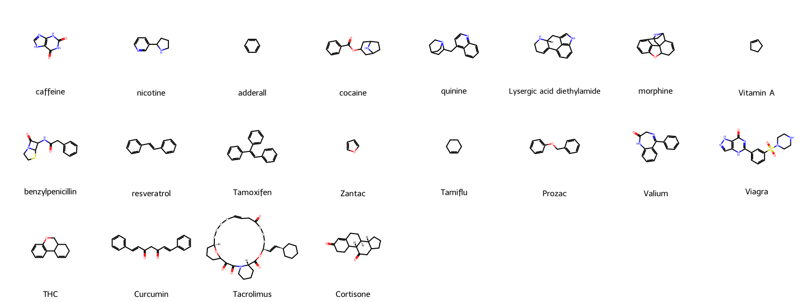

# `RDKIT-TOOLS`

Tools for use with RDKit. Motivated and intended for use with
[CFDE](https://nih-cfde.org/) and CFChemDb, developed by the IDG-CFDE team.

See also:

* [CFChemDb](https://github.com/unmtransinfo/CFChemDb) (repository)
* [CFChemDb_UI](https://github.com/jeremyjyang/CFChemDb_UI) (repository)
* [rdktools](https://pypi.org/project/rdktools/) (Pypi package)
* [CFDE: Common Fund Data Ecosystem](https://nih-cfde.org/)

RDKit:

* <https://rdkit.org>
* <https://www.rdkit.org/docs/Install.html>

## Dependencies

* RDKit Python package (via conda recommended).

```
$ conda create -n rdktools -c conda-forge rdkit ipykernel
$ conda activate rdktools
(rdktools) $ conda install -c conda-forge pyvis 
(rdktools) $ conda install -c conda-forge networkx=2.5 
```

See also: [conda/environment.yml](conda/environment.yml)

## Contents

* [Formats](#Formats) - chemical file format conversion
* [Depictions](#Depictions) - 2D molecular depictions
* [Standardization](#Standardization) - molecular standardization 
* [Fingerprints](#Fingerprints) - molecular path and pattern based binary feature vectors, similarity, and clustering tools
* [Conformations](#Conformations) - distance geometry based 3D conformation generation
* [Properties](#Properties) - molecular property calculation: Lipinsky, Wildman-Crippen LogP, Kier-Hall electrotopological descriptors, solvent accessible surface area (SASA), and more.
* [Scaffolds](#Scaffolds) - Bemis-Murcko and BRICS scaffold analysis, rdScaffoldNetworks.
* [SMARTS](#SMARTS) - molecular pattern matching (subgraph isomorphism)
* [Reactions](#Reactions) - Reaction SMILES, SMARTS, and SMIRKS based reaction analytics
* [util.sklearn](#util.sklearn) - Scikit-learn utilities for processing molecular fingerprints and other feature vectors.


## Formats

```
(rdktools) $ python3 -m rdktools.formats.App -h
usage: App.py [-h] [--i IFILE] [--o OFILE] [--kekulize] [--sanitize] [--header]
              [--delim DELIM] [--smilesColumn SMILESCOLUMN] [--nameColumn NAMECOLUMN]
              [-v]
              {mdl2smi,mdl2tsv,smi2mdl,smiclean,mdlclean,mol2inchi,mol2inchikey,demo}

RDKit chemical format utility

positional arguments:
  {mdl2smi,mdl2tsv,smi2mdl,smiclean,mdlclean,mol2inchi,mol2inchikey,demo}
                        operation

optional arguments:
  -h, --help            show this help message and exit
  --i IFILE             input file (SMILES/TSV or SDF)
  --o OFILE             output file (specify '-' for stdout)
  --kekulize            Kekulize
  --sanitize            Sanitize
  --header              input SMILES/TSV file has header line
  --delim DELIM         delimiter for SMILES/TSV
  --smilesColumn SMILESCOLUMN
                        input SMILES column
  --nameColumn NAMECOLUMN
                        input name column
  -v, --verbose
```

## Depictions

```
(rdktools) $ python3 -m rdktools.depict.App -h
usage: App.py [-h] [--i IFILE] [--ifmt {AUTO,SMI,MDL}] [--ofmt {PNG,JPEG,PDF}]
              [--smilesColumn SMILESCOLUMN] [--nameColumn NAMECOLUMN] [--header]
              [--delim DELIM] [--height HEIGHT] [--width WIDTH] [--kekulize]
              [--wedgebonds] [--pdf_title PDF_TITLE] [--batch_dir BATCH_DIR]
              [--batch_prefix BATCH_PREFIX] [--o OFILE] [-v]
              {single,batch,pdf,demo,demo2}

RDKit molecule depiction utility

positional arguments:
  {single,batch,pdf,demo,demo2}
                        OPERATION

optional arguments:
  -h, --help            show this help message and exit
  --i IFILE             input molecule file
  --ifmt {AUTO,SMI,MDL}
                        input file format
  --ofmt {PNG,JPEG,PDF}
                        output file format
  --smilesColumn SMILESCOLUMN
  --nameColumn NAMECOLUMN
  --header              SMILES/TSV file has header
  --delim DELIM         SMILES/TSV field delimiter
  --height HEIGHT       height of image
  --width WIDTH         width of image
  --kekulize            display Kekule form
  --wedgebonds          stereo wedge bonds
  --pdf_title PDF_TITLE
                        PDF doc title
  --batch_dir BATCH_DIR
                        destination for batch files
  --batch_prefix BATCH_PREFIX
                        prefix for batch files
  --o OFILE             output file
  -v, --verbose

Modes: single = one image; batch = multiple images; pdf = multi-page
```

```
python3 -m rdktools.depict.App single -height 500 --width 600 --i valium.smiles --o valium.png 
```


## Scaffolds

```
(rdktools) $ python3 -m rdktools.scaffold.App -h
usage: App.py [-h] [--i IFILE] [--o OFILE] [--o_html OFILE_HTML]
              [--scratchdir SCRATCHDIR] [--smicol SMICOL] [--namcol NAMCOL]
              [--idelim IDELIM] [--odelim ODELIM] [--iheader] [--oheader]
              [--brics] [-v]
              {bmscaf,scafnet,demobm,demonet,demonetvis}

RDKit scaffold analysis

positional arguments:
  {bmscaf,scafnet,demobm,demonet,demonetvis}
                        OPERATION

optional arguments:
  -h, --help            show this help message and exit
  --i IFILE             input file, TSV or SDF
  --o OFILE             output file, TSV|SDF
  --o_html OFILE_HTML   output file, HTML
  --scratchdir SCRATCHDIR
  --smicol SMICOL       SMILES column from TSV (counting from 0)
  --namcol NAMCOL       name column from TSV (counting from 0)
  --idelim IDELIM       delim for input TSV
  --odelim ODELIM       delim for output TSV
  --iheader             input TSV has header
  --oheader             output TSV has header
  --brics               BRICS fragmentation rules (Degen, 2008)
  -v, --verbose
```

```
python3 -m rdktools.scaffold.App bmscaf --i drugs.smiles --o_vis drugs_bmscaf.png
```



## Standardization

```
(rdktools) $ python3 -m rdktools.standard.App
usage: App.py [-h] [--i IFILE] [--o OFILE] [--norms {default,unm}]
              [--i_norms IFILE_NORMS] [--remove_isomerism] [-v]
              {standardize,list_norms,show_params,demo}
App.py: error: the following arguments are required: op
(rdktools) $ python3 -m rdktools.standard.App -h
usage: App.py [-h] [--i IFILE] [--o OFILE] [--norms {default,unm}]
              [--i_norms IFILE_NORMS] [--remove_isomerism] [-v]
              {standardize,list_norms,show_params,demo}

RDKit chemical standardizer

positional arguments:
  {standardize,list_norms,show_params,demo}
                        operation

optional arguments:
  -h, --help            show this help message and exit
  --i IFILE             input file, SMI or SDF
  --o OFILE             output file, SMI or SDF
  --norms {default,unm}
                        normalizations
  --i_norms IFILE_NORMS
                        input normalizations file, format: SMIRKS<space>NAME
  --remove_isomerism    if true, output SMILES isomerism removed
  -v, --verbose
```

## Conformations

```
(rdktools) $ python3 -m rdktools.conform.App -h
usage: App.py [-h] [--i IFILE] [--o OFILE] [--ff {UFF,MMFF}] [--optiters OPTITERS]
              [--nconf NCONF] [--etol ETOL] [--title_in_header] [-v]

RDKit Conformer Generation

optional arguments:
  -h, --help           show this help message and exit
  --i IFILE            input file, SMI or SDF
  --o OFILE            output SDF with 3D
  --ff {UFF,MMFF}      force-field
  --optiters OPTITERS  optimizer iterations per conf
  --nconf NCONF        # confs per mol
  --etol ETOL          energy tolerance
  --title_in_header    title line in header
  -v, --verbose

Based on distance geometry method by Blaney et al.
```

## Fingerprints

By default, RDKit and Morgan fingerprints are generated length 2048 bits,
by the following methods:

**RDKit path-based, Daylight-like**:
```
Chem.RDKFingerprint(mol, minPath=1, maxPath=7, fpSize=2048, nBitsPerHash=2, useHs=False, minSize=2048)
```

**Morgan ECFP-like**:
```
AllChem.GetMorganFingerprintAsBitVect(mol, radius=2, nBits=2048)
```

```
(rdktools) $ python3 -m rdktools.fp.App -h

usage: App.py [-h] [--i IFILE] [--iheader] [--o OFILE] [--output_as_dataframe]
              [--output_as_tsv] [--useHs] [--useValence] [--dbName DBNAME]
              [--tableName TABLENAME] [--minSize MINSIZE] [--maxSize MAXSIZE]
              [--density DENSITY] [--outTable OUTTABLE] [--outDbName OUTDBNAME]
              [--fpColName FPCOLNAME] [--minPath MINPATH] [--maxPath MAXPATH]
              [--nBitsPerHash NBITSPERHASH] [--discrim] [--smilesColumn SMILESCOLUMN]
              [--molPkl MOLPKL] [--input_format {SMILES,SD}] [--idColumn IDCOLUMN]
              [--maxMols MAXMOLS] [--fpAlgo {RDKIT,MACCS,MORGAN}]
              [--morgan_nbits MORGAN_NBITS] [--morgan_radius MORGAN_RADIUS]
              [--replaceTable] [--smilesTable SMILESTABLE] [--topN TOPN]
              [--thresh THRESH] [--querySmiles QUERYSMILES]
              [--metric {ALLBIT,ASYMMETRIC,DICE,COSINE,KULCZYNSKI,MCCONNAUGHEY,ONBIT,RUSSEL,SOKAL,TANIMOTO,TVERSKY}]
              [--tversky_alpha TVERSKY_ALPHA] [--tversky_beta TVERSKY_BETA]
              [--clusterAlgo {WARD,SLINK,CLINK,UPGMA,BUTINA}] [--actTable ACTTABLE]
              [--actName ACTNAME] [--reportFreq REPORTFREQ] [--showVis] [-v]
              {FingerprintMols,MolSimilarity,ClusterMols}

RDKit fingerprint-based analytics

positional arguments:
  {FingerprintMols,MolSimilarity,ClusterMols}
                        OPERATION

optional arguments:
  -h, --help            show this help message and exit
  --i IFILE             input file; if provided and no tableName is specified, data will
                        be read from the input file. Text files delimited with either
                        commas (extension .csv) or tabs (extension .txt) are supported.
  --iheader             input file has header line
  --o OFILE             output file (pickle file with one label,fingerprint entry for
                        each molecule).
  --output_as_dataframe
                        Output FPs as Pandas dataframe (pickled) with names as index,
                        columns as feature names, if available.
  --output_as_tsv       Output FPs as TSV with names as index, columns as feature names,
                        if available.
  --useHs               include Hs in the fingerprint Default is *false*.
  --useValence          include valence information in the fingerprints Default is
                        *false*.
  --dbName DBNAME       name of the database from which to pull input molecule
                        information. If output is going to a database, this will also be
                        used for that unless the --outDbName option is used.
  --tableName TABLENAME
                        name of the database table from which to pull input molecule
                        information
  --minSize MINSIZE     minimum size of the fingerprints to be generated (limits the
                        amount of folding that happens) [64].
  --maxSize MAXSIZE     base size of the fingerprints to be generated [2048].
  --density DENSITY     target bit density in the fingerprint. The fingerprint will be
                        folded until this density is reached [0.3].
  --outTable OUTTABLE   name of the output db table used to store fingerprints. If this
                        table already exists, it will be replaced.
  --outDbName OUTDBNAME
                        name of output database, if it's being used. Defaults to be the
                        same as the input db.
  --fpColName FPCOLNAME
                        name to use for the column which stores fingerprints (in pickled
                        format) in the output db table [AutoFragmentFP].
  --minPath MINPATH     minimum path length to be included in fragment-based
                        fingerprints [1].
  --maxPath MAXPATH     maximum path length to be included in fragment-based
                        fingerprints [7].
  --nBitsPerHash NBITSPERHASH
                        number of bits to be set in the output fingerprint for each
                        fragment [2].
  --discrim             use of path-based discriminators to hash bits.
  --smilesColumn SMILESCOLUMN
                        name of the SMILES column in the input database [#SMILES].
  --molPkl MOLPKL
  --input_format {SMILES,SD}
                        SMILES table or SDF file [{DEFAULTS['input_format']}].
  --idColumn IDCOLUMN, --nameColumn IDCOLUMN
                        name of the id column in the input database. Defaults to the
                        first column for dbs [Name].
  --maxMols MAXMOLS     maximum number of molecules to be fingerprinted.
  --fpAlgo {RDKIT,MACCS,MORGAN}
                        RDKIT = Daylight path-based; MACCS = MDL MACCS 166 keys [RDKIT]
  --morgan_nbits MORGAN_NBITS
                        [1024]
  --morgan_radius MORGAN_RADIUS
                        [2]
  --replaceTable
  --smilesTable SMILESTABLE
                        name of database table which contains SMILES for the input
                        fingerprints. If provided with --smilesName, output will contain
                        SMILES data.
  --topN TOPN           top N similar; precedence over threshold [12].
  --thresh THRESH       similarity threshold.
  --querySmiles QUERYSMILES
                        query smiles for similarity screening.
  --metric {ALLBIT,ASYMMETRIC,DICE,COSINE,KULCZYNSKI,MCCONNAUGHEY,ONBIT,RUSSEL,SOKAL,TANIMOTO,TVERSKY}
                        similarity algorithm [TANIMOTO]
  --tversky_alpha TVERSKY_ALPHA
                        Tversky alpha parameter, weights query molecule features [0.8]
  --tversky_beta TVERSKY_BETA
                        Tversky beta parameter, weights target molecule features [0.2]
  --clusterAlgo {WARD,SLINK,CLINK,UPGMA,BUTINA}
                        clustering algorithm: WARD = Ward's minimum variance; SLINK =
                        single-linkage clustering algorithm; CLINK = complete-linkage
                        clustering algorithm; UPGMA = group-average clustering
                        algorithm; BUTINA = Butina JCICS 39 747-750 (1999) [WARD]
  --actTable ACTTABLE   name of table containing activity values (used to color points
                        in the cluster tree).
  --actName ACTNAME     name of column with activities in the activity table. The values
                        in this column should either be integers or convertible into
                        integers.
  --reportFreq REPORTFREQ
                        [100]
  --showVis             show visualization if available.
  -v, --verbose

This app employs custom, updated versions of RDKit FingerprintMols.py, MolSimilarity.py,
ClusterMols.py, with enhanced command-line functionality for molecular fingerprint-based
analytics.
```

Examples:

```
(rdktools) $ python3 -m rdktools.fp.App FingerprintMols --i drugcentral.smiles --smilesColumn "smiles" --idColumn "name" --fpAlgo MORGAN --morgan_nbits 2048 --output_as_tsv --o drugcentral_morganfp.tsv
```

```
(rdktools) $ python3 -m rdktools.fp.App MolSimilarity --i drugcentral.smiles --smilesColumn "smiles" --idColumn "name" --querySmiles "NCCc1ccc(O)c(O)c1 dopamine" --fpAlgo MORGAN --morgan_nbits 512 --metric TVERSKY --tversky_alpha 0.8 --tversky_beta 0.2
```

```
(rdktools) $ python3 -m rdktools.fp.App ClusterMols --i drugcentral.smiles --smilesColumn "smiles" --idColumn "name" --fpAlgo MORGAN --morgan_nbits 512 --clusterAlgo BUTINA --metric TANIMOTO
```

## SMARTS

```
(rdktools) $ python3 -m rdktools.smarts.App -h
usage: App.py [-h] [--i IFILE] [--o OFILE] [--smarts SMARTS] [--usa] [--delim DELIM]
              [--smilesColumn SMILESCOLUMN] [--nameColumn NAMECOLUMN] [--header] [-v]
              {matchCounts,matchFilter,demo}

RDKit SMARTS utility

positional arguments:
  {matchCounts,matchFilter,demo}
                        OPERATION

optional arguments:
  -h, --help            show this help message and exit
  --i IFILE             input file, SMI or SDF
  --o OFILE             output file, TSV
  --smarts SMARTS       query SMARTS
  --usa                 unique set-of-atoms match counts
  --delim DELIM         delimiter for SMILES/TSV
  --smilesColumn SMILESCOLUMN
  --nameColumn NAMECOLUMN
  --header              SMILES/TSV has header line
  -v, --verbose
```

## Reactions

```
$ python3 -m rdktools.reactions.App -h
usage: App.py [-h] [--i IFILES] [--o OFILE] [--output_mode {products,reactions}]
              [--o_depict OFILE_DEPICT] [--smirks SMIRKS] [--kekulize] [--sanitize]
              [--depict] [--header] [--delim DELIM] [--smilesColumn SMILESCOLUMN]
              [--nameColumn NAMECOLUMN] [-v]
              {enumerateLibrary,react,demo,demo2,demo3,demo4}

RDKit chemical reactions utility

positional arguments:
  {enumerateLibrary,react,demo,demo2,demo3,demo4}
                        OPERATION

optional arguments:
  -h, --help            show this help message and exit
  --i IFILES            input file[s] (SMILES/TSV or SDF)
  --o OFILE             output file (SMILES) [stdout]
  --output_mode {products,reactions}
                        products|reactions [products]
  --o_depict OFILE_DEPICT
                        output depiction file (PNG) [display]
  --smirks SMIRKS       SMIRKS reaction transform
  --kekulize            Kekulize
  --sanitize            Sanitize
  --depict              Depict (1st reaction or product only)
  --header              input SMILES/TSV file has header line
  --delim DELIM         delimiter for SMILES/TSV
  --smilesColumn SMILESCOLUMN
                        input SMILES column
  --nameColumn NAMECOLUMN
                        input name column
  -v, --verbose

For 'react' operation, reactants are specified as disconnected components of single
input molecule record. For 'enumerateLibrary', reactants for each role are specfied from
separate input files, ordered as in the SMIRKS.
```

```
python3 -m rdktools.reactions.App react --smirks '[O:2]=[C:1][OH].[N:3]>>[O:2][C:1][N:3]' --i reactants.smiles --nameColumn 0 --depict --o_depict reaction.png
```


## Properties

```
(rdktools) $ python3 -m rdktools.properties.App -h
usage: App.py [-h] --i IFILE [--o OFILE] [--iheader] [--oheader] [--kekulize]
              [--sanitize] [--delim DELIM] [--smilesColumn SMILESCOLUMN]
              [--nameColumn NAMECOLUMN] [-v]
              {descriptors,descriptors3d,lipinski,logp,estate,freesasa,demo}

RDKit molecular properties utility

positional arguments:
  {descriptors,descriptors3d,lipinski,logp,estate,freesasa,demo}
                        OPERATION

optional arguments:
  -h, --help            show this help message and exit
  --i IFILE             input molecule file
  --o OFILE             output file with data (TSV)
  --iheader             input file has header line
  --oheader             include TSV header line with smiles output
  --kekulize            Kekulize
  --sanitize            Sanitize
  --delim DELIM         SMILES/TSV delimiter
  --smilesColumn SMILESCOLUMN
                        input SMILES column
  --nameColumn NAMECOLUMN
                        input name column
  -v, --verbose
```

### util.sklearn

Scikit-learn utilities for processing molecular fingerprints and other feature vectors.

```
(rdktools) lengua$ python3 -m rdktools.util.sklearn.ClusterFingerprints -h
usage: ClusterFingerprints.py [-h] [--i IFILE] [--o OFILE] [--o_vis OFILE_VIS]
                              [--scratchdir SCRATCHDIR] [--idelim IDELIM]
                              [--odelim ODELIM]
                              [--affinity {euclidean,l1,l2,manhattan,cosine,precomputed}]
                              [--linkage {ward,complete,average,single}]
                              [--truncate_level TRUNCATE_LEVEL] [--iheader] [--oheader]
                              [--dendrogram_orientation {left,top,right,bottom}]
                              [--display] [-v]
                              {cluster,demo}

Hierarchical, agglomerative clustering by Scikit-learn

positional arguments:
  {cluster,demo}        OPERATION

optional arguments:
  -h, --help            show this help message and exit
  --i IFILE             input file, TSV
  --o OFILE             output file, TSV
  --o_vis OFILE_VIS     output file, PNG or HTML
  --scratchdir SCRATCHDIR
  --idelim IDELIM       delim for input TSV
  --odelim ODELIM       delim for output TSV
  --affinity {euclidean,l1,l2,manhattan,cosine,precomputed}
  --linkage {ward,complete,average,single}
  --truncate_level TRUNCATE_LEVEL
                        Level from root of hierarchy for clusters and dendrogram.
  --iheader             input TSV has header
  --oheader             output TSV has header
  --dendrogram_orientation {left,top,right,bottom}
  --display             display dendrogram
  -v, --verbose
```

```
(rdktools) $ python3 -m rdktools.util.sklearn.ClusterFingerprints cluster --i drugcentral_morganfp.tsv --truncate_level 5 --o_vis drugcentral_morganfp_ward-clusters_dendrogram.png
```


